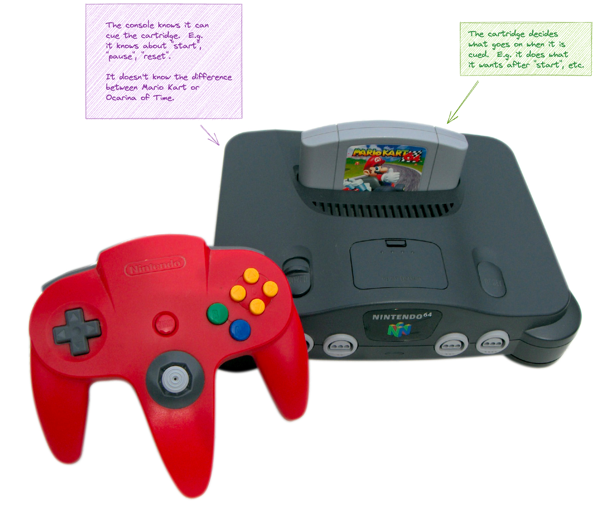
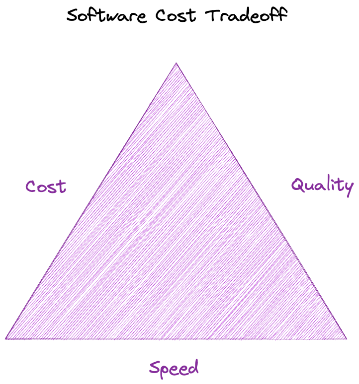
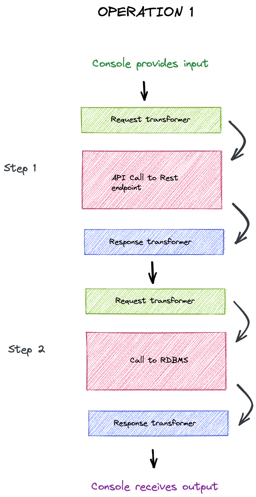

# console-cartridge-contract

<p align="center">
  
</p>

A design pattern to help separate implemenation details from execution.

## Table of Contents

- [Introduction](#introduction)
  - [Problem Statement]()
- [Is It A Design Pattern](#is-it-a-design-pattern)
- [Lexicon](#lexicon)
  - [Cartridge](#cartridge)
  - [Console](#console)
- [Benefits](#benefits)
- [Drawbacks](#drawbacks)

## Introduction

_Design Patterns_ are a [relatively well known concept](https://en.wikipedia.org/wiki/Design_pattern), first widely popularized with the ["Gang of Four" book](https://en.wikipedia.org/wiki/Design_Patterns) in 1994&#8224;. In the world of [Object-Oriented Programming](https://en.wikipedia.org/wiki/Object-oriented_programming)(OOP), Design Patterns became widely popular advocating this "behavior by composition" philosophy that permeates much OOP heavy languages.

_However_, not all of these patterns fit into a more [_Functional Programming_](https://en.wikipedia.org/wiki/Functional_programming) paradigm, where the rubric is "separate data from behavior".

This has been a tricky beast to wrangle within the world of ECMAScript (JavaScript, TypeScript, etc) especially considering JavaScript (JS) to be rooted in the [_Functional Programming_ paradigm](https://en.wikipedia.org/wiki/JavaScript#Creation_at_Netscape).

Many patterns just don't seem to fit well with this practice or are, at best, adopted inconsistently leading to wildly divergent code styles.

How does that relate to this project?

We envisioned an archtiecture where higher order patterns than those commonly described in typical _Design Pattern_ language is encapsulated in such a way that you could separate the code entirely. Imagine, if you will a system that is composed of two pieces:

- A module that contains specific details regarding implementation.
- A module that contains the machinery that executes the implementation via pattern.

Let's use the analogy (conceit, really) that this entire project is founded on:

- A **Cartridge** is implemenation details that fullfill a contract. The IO logic to retrieve a document. The transformers to convert the document to another structure, etc.
- A **Console** knows how to execute the steps in the _Cartridge_ but doesn't know anything about the internals of the _Cartridge_. E.g. the _Console_ knows it needs to execute functions from the contract in a specific order, how to log each step, and how to control workflow and execution.

<p align="center">
  
</p>

This isn't a concept that is too far removed from the conceit itself, which is of a digital computer and the role of the physical hardware in [Von Neumann archtitecture](https://en.wikipedia.org/wiki/Von_Neumann_architecture).

&#8224; [Not the band](https://youtu.be/I_QJwR6D9d4). RIP Andy Gill.

[Top](#table-of-contents)

### Problem Statement

Let's step back a bit. We've already hinted at our proposed solution, but the question is "what problem are we trying to solve?"

First, we certainly believe that FP practices improve the maintainability and design of our code. We want to make sure we have a pattern in place that:

- Encourages separating "side-effect" from deterministic functions.
  - _Side-effects_ are things like IO calls that maybe have bad auth or are unavailable (throttling, DDOS, etc).
  - Deterministic functions are things we _should_ be able to control... e.g. data from an `HttpResponse` in a given shape, should always transform to the same shape when we call a transformer.
- Break up code into smaller, easier to test functions.
- Avoid wildly differing implementations or, at least, wildly different on a macro level (e.g. one function does everything, etc. See the ["Counter Example"](#cartridge-counter-example) for more).

We also want to make it easy for our teams and team members to succeed. We want them to have pride in building well designed and tested systems.

So, let's come up with a single problem statement:

> As a system designer, I would like a system with software components that are quick to build and easy to maintain.

Ahh... such a lofty goal!

Remember, the old ["Iron Triangle"](https://www.freecodecamp.org/news/the-iron-triangle-or-pick-two/) of software. While there are valid arguments describing this model as "overly-simplistic" it is still a reality of engineering. Cost, quality, or speed. Pick two.

<p align="center">
  
</p>

Software is _expensive_ and with over fifty years of analysis of software, it turns out that the _most expensive_ part of software is maintenance.

> Software maintenance is defined in the IEEE Standard for Software Maintenance (IEEE 14764-2006 - ISO/IEC) as the modification of a software product after delivery to correct faults, to improve performance or other attributes, or to adapt the product to a modified environment. It lasts for the lifespan of the software and requires careful logging and tracking of change requests as per the guidelines for change management set out at the end of the requirements phase.

[_Software Maintenance_ on ScienceDirect](https://www.sciencedirect.com/topics/computer-science/software-maintenance)

More specifically, the discpline of Software Engineering arose as an attempt to reduce these not insubstantial costs:

> Large software programs are usually long lived and continually evolve. Substantial maintenance effort is often extended by engineers trying to understand the software prior to making changes. To successfully evolve the software, a thorough understanding of the architect's intentions about software organization is required. Software maintenance costs can be reduced significantly if the software architecture is well defined, clearly documented, and creates an environment that promotes design consistency through the use of guidelines and design patterns. Building a maintainable system depends upon the consistent application of these architectural practices.

[_Reducing maintenance costs through the application of modern software architecture principles_ from ACM SIGAda](https://dl.acm.org/doi/10.1145/319295.319311)

_Object Oriented Programming_, _Object Oriented Design_, _Design Patterns_, _Test Driven Development_, are all concepts that arose in an attempt to address these deficiencies.

To be fair, this is a moving target. What seems like a good solution in 2022, may seem antiquated in 2040.

OOP has had a parcticularly long life, with regards to design paradigms. It arose in the eighties and came to prominence in the 90s and aughts, with the rise in popularity of C-family languages that supported it: C++, C#, Java, Objective-C, etc.

JavaScript, on the other hand, isn't really an OO language. It barely has OO features, but that is another story.

Even advocates of OOP were critical of the wildfire way in which it spread and today, there are countless legacy systems that are built on J2EE/JE/Jakarta (same technology, the name has changed) stacks that probably won't go anywhere.

But OOP has let us down and in 2022 it has become quite obvious:

> OOP is considered by many to be the crown jewel of computer science. The ultimate solution to code organization. The end to all our problems. The only true way to write our programs. Bestowed upon us by the one true God of programming himself…

> Until…it’s not, and people start succumbing under the weight of abstractions, and the complex graph of promiscuously shared mutable objects. Precious time and brainpower are being spent thinking about “abstractions” and “design patterns” instead of solving real-world problems.

[_Object-Oriented Programming — The Trillion Dollar Disaster_](https://betterprogramming.pub/object-oriented-programming-the-trillion-dollar-disaster-92a4b666c7c7)

As an exercise for the reader, you can find countless articles from all segments of the software world ridiculing just how insidious the OO paradigm has become... and how it's failed.

Now _functional programming_ (which predates OO) has been growing in popularity with the rise of Node.js, JavaScript (and libraries like `lodash`), Scala, F#, etc. Is it just another bit of snake oil?

Perhaps. But quite a few folks believe that it addresses and better decomposes concepts that OO tries to mask. A clever Redditor had a very succinct way of describing this:

> OOP as a paradigm incentivizes code obfuscation (which is for some reason confused with abstraction), while [functional programming] tends to make things as explicit as possible…

[r/programming](https://www.reddit.com/r/programming/comments/cblhk1/comment/etjwaqy/?utm_source=share&utm_medium=web2x&context=3)

The Console-Cartridge concept is an attempt to encourage FP design with a modular architecture that holds true to this concept. We expose crucial steps and _isolate_ side effects.

To be clear, let's talk about that.

A _side effect_, in functional terms, is a function that may not return something, but the key feature is that it relies on a _non-deterministic_ resource. Typically this is IO. Things like HTTP calls or queries to an RDBMS that rely on networking, etc. The `Cartridge` design attempts to encourage developers to isolate _side effect_ functions and design around _deterministic_ behavior.

We elaborate on this in the sections on [`Cartridge`](#example-cartridge) and the [counter example](#cartridge-counter-example).

[Top](#table-of-contents)

## Is It A Design Pattern?

_Design Patterns_ are often considered "dirty words" or smack of ["code smell"](https://en.wikipedia.org/wiki/Code_smell). A times this is warranted as for every _Design Pattern_ there are a litany of [_Anti-patterns_](https://en.wikipedia.org/wiki/Anti-pattern). OOP frameworks like Java and C# have often been riddled with boilerplate interfaces and a level of indirection and abstraction that makes the most costly aspect of software engineering (maintenance) difficult.

However, this could be viewed as a _structural_ Design Pattern composed of concepts from existing patterns.

Chiefly:

- A [facade](https://en.wikipedia.org/wiki/Facade_pattern).
- A [bridge](https://en.wikipedia.org/wiki/Bridge_pattern).

But let's assume that you're not familiar with those patterns and talk more broadly about what we're proposing.

[Top](#table-of-contents)

## Lexicon

In our system a _console_ is the machinary the exercises an interface. In our example code, we have the classic "PetShop" concept. The machine that is used to find and purchase items from the pet shop is the _console_. It does not know anything about the particulars of a given PetShop vendor's code. It merely exposes/exercises the code necessary to shop and buy from any vendor.

The vendor specific code, in the PetShop example, _abstracts_ the details of interacting with a given vendor. This is a _cartridge_.

For example, vendors share broad actions like:

- Get me offers for a given good. E.g. what are your prices on cans of Alpo?
- Let me buy said good. E.g. I would like to buy 10 cans of Alpo.

But the specifics may vary widely. One pet shop chain's API may only support [_SOAP_](https://en.wikipedia.org/wiki/SOAP) while another may be JSON via [REST](https://en.wikipedia.org/wiki/Representational_state_transfer). One chain may require a "session" to be created for interacting with their API.

[Top](#table-of-contents)

### Cartridge

Ideally, for a given application, you would be largely defining _cartridges_. There are two phases to this:

1. Defining the shape of your application's cartridge. This is akin to the `facade` pattern. In our example, `PetShoppingSupplier` is the interface that meets the broad requirements of our system's functionality.
1. Implementining instances of your cartridge. In our example, we would write a `PetShoppingSupplier` cartridge for each vendor. E.g. one is written for PetSmart, one for PetCo, et cetera.

At first blush, this does seem akin to a simple _facade_, yet there are some details to the _facade_ that are important. Let's look at some examples.

- [Example Cartridge](#example-cartridge)
- [Cartridge Counter Example](#cartridge-counter-example)

[Top](#table-of-contents)

#### Example Cartridge

In the included example, we have a `Cartridge` designed around a `PetShoppingSupplier`. At this level, you (as a system designer) would implement a `Cartridge` that encapsulates cueing (commands), inputs, and outputs toe the `Console`. E.g. you want an interface that can be coded to for any given Pet Store we would want to interact with.

[`src/examples/cartridge/shopping/types/PetShoppingSupplier.ts`](src/examples/cartridge/shopping/types/PetShoppingSupplier.ts)

```ts
import { Cartridge } from '@console-cartridge-contract/types';

import { OffersOperation, PurchaseOperation } from './operations';

export interface PetShoppingSupplier extends Cartridge {
  operations: [OffersOperation, PurchaseOperation];
}
```

Every `Cartridge`, be it for PetCo, Chewy, etc, would be written to support this interface. You or your developers would implement a `PetShoppingSupplier` germane to a given supplier.

The two key pieces here are the `operations`.

[`src/examples/cartridge/shopping/types/operations/OffersOperation.ts`](src/examples/cartridge/shopping/types/operations/OffersOperation.ts)

```ts
export interface OffersOperation
  extends Operation<any, string, string, PetShopInventoryItem[]> {
  name: 'OffersOperation';
  steps: [
    {
      operation: (string) => Promise<string>;
      transform: {
        request: (n) => string;
        response: (n) => PetShopInventoryItem[];
      };
    },
  ];
}
```

In our system, we have defined an `Operation` to have a set of steps which comprise an `operation` (the side-effect function such as an IO operation) and, _potentially_ a `transform`. The steps allow the _implementors_ to chain requried nested `operations`. E.g. perhaps a call to a REST endpoint requires pulling a value from a local cache to decorate the request and the response.

Each step's output flows into the next step:

<p align="center">
  
</p>

For many operations, there will most likely be one step. But multiple steps are useful in cases where data must be injected/linked to a set of IO based calls.

In most cases, we would expect a set of `transform` operations, but we do allow the creation of an `operation` `step` that may have no transformations. This is especially true if a given `step` is interacting with another system you control. E.g. you have a different API layer your system needs to interact with. It is highly likely that the shape of both the request and the response need no transformation.

If we look at the _implementation_ of a `PetShoppingSupplier`, particularly an `operation`, we can see this more clearly.

[`src/examples/cartridge/shopping/suppliers/mockaroo/mockarooPetShoppingCartridge.ts`](src/examples/cartridge/shopping/suppliers/mockaroo/mockarooPetShoppingCartridge.ts)

```ts
import { offersOperation } from './offersOperation';
import { purchaseOperation } from './purchaseOperation/purchaseOperation';

import { PetShoppingSupplier } from '@console-cartridge-contract/examples/cartridge/shopping/types';

export const mockarooPetShoppingCartridge: PetShoppingSupplier = {
  name: 'Mockaroo',
  logger: console.log,
  operations: [offersOperation, purchaseOperation],
};
```

This cartridge adds a mild amount of detail/decoration to the functions it implements. This is mostly to provide things like a universal logger, etc.

[`src/examples/cartridge/shopping/suppliers/mockaroo/offersOperation/offersOperation.ts`](src/examples/cartridge/shopping/suppliers/mockaroo/offersOperation/offersOperation.ts)

```ts
import { httpGet } from '@console-cartridge-contract/util/io';

import { transformOffersOperationRequest } from './transformOffersOperationRequest';
import { transformOffersOperationResponse } from './transformOffersOperationResponse';

import { OffersOperation } from '@console-cartridge-contract/examples/cartridge/shopping/types/operations';
import { mockarooHTTPClient } from '../io';

export const offersOperation: OffersOperation = {
  name: 'OffersOperation',
  steps: [
    {
      operation: httpGet(mockarooHTTPClient),
      transform: {
        request: transformOffersOperationRequest,
        response: transformOffersOperationResponse,
      },
    },
  ],
};
```

Now we see what we are on about. We have a single step (get offers from an endpoint) and transformers for the operation.

The function `httpGet` is a curried function that expects a `path`. In this system, the `path` is provided by the `request` transformer to the `httpGet` function that the `Console` will call (without knowing):

```ts
export const httpGet =
  (client: AxiosInstance) => async (relativePath: string) => {
    const response = await client.get<string>(relativePath);
    return response.data;
  };
```

If we look at the `transformOffersOperationRequest` function, we can see how this is provided:

[`src/examples/cartridge/shopping/suppliers/mockaroo/offersOperation/transformOffersOperationRequest.ts`](src/examples/cartridge/shopping/suppliers/mockaroo/offersOperation/transformOffersOperationRequest.ts)

```ts
interface GetRequestTransformer<InputType> {
  (input: InputType): string;
}

export const transformOffersOperationRequest: GetRequestTransformer<
  PetShopCategory
> = (category) => `products.xml?category=${category}`;
```

We can see that all it is doing is taking in a `category` (which would come from the Console, perhaps via a REST call from another system, or from a data source, that is not important to our Cartridge) and returning a relative path for the curried function from `httpGet` to utilize.

For symmetry, we can see how this is then transformed into a shape our system prefers:

[`src/examples/cartridge/shopping/suppliers/mockaroo/offersOperation/transformOffersOperationResponse.ts`](src/examples/cartridge/shopping/suppliers/mockaroo/offersOperation/transformOffersOperationResponse.ts)

```ts
export interface TransformOffersOperationResponse {
  (string): PetShopInventoryItem[];
}

export const getProductsFromResponse = (obj: any) =>
  get<PetShopInventoryItem[]>(obj, 'products', []);

export const transformOffersOperationResponse: TransformOffersOperationResponse =
  flow(unfuxml, getProductsFromResponse);
```

`transformOffersOperationResponse` utilizes some goodies from `lodash` and an xml to json parser (`unfuxml`) to transform an XML body into JSON, then extract the only part of the JSON object we care about, the `products` array.

Now you may find you asking yourself (or me):

> Why not just expose _one_ function in the cartridge? Why the need for steps and transformers?

From a pure data and division of responsibility standpoint, you are correct. This is a bit unnecessary. _However_, we have all worked in systems where this approach was taken and when sufficient numbers of development teams code to this simpler standard, we get wildly varying results.

This approach has a few benefits:

- Separating IO from transformation allows us to easily log transformation stages, trace where defects are introduced (did the response shape change or include unexpected values), etc.
- Enforcing separation of steps and transformations means that whomever is implementing the cartridge has to follow this pattern. This encourages better code composition, smaller pull requests, and encourages a test-driven approach.

[Cartridge](#cartridge)

[Top](#table-of-contents)

#### Cartridge Counter Example

Let's say that we change our design and we have a single `getOffers` function that the `Cartridge` provides to the console. Let's look at two design approaches to implementing this.

`getOffers` for supplier 1:

```ts
export const getOffers = async (category: String) => {
  const response = axios.get(
    `https://api-endpoint.com/products?category=${category}`,
    {
      headers: {
        Authorization: 'Basic hardcodedToken==',
      },
    },
  );

  return JSON.parse(response.data).products;
};
```

Now this function is pretty simple. It makes an `axios` request and then does some transformations before returning the output.

_However_, it is also problematic:

- Testing it requires mocking `axios`, which can be brittle.
- It's tied to `axios`. We can not easily swap in a different library.
- Depending on how it's employed, it could be difficult to trace runtime errors:
  - Did the error happen on the endpoint (say bad credentials, etc)?
  - Did the error happen in the request transformation to the literal URI?
  - Did the error happen in the transformation? Was the JSON bad or was there no `products` value?

These problems are not insurmountable, but as the complexity of the code grows (say the transformation steps are lengthy or the IO calls require paging), it gets harder and harder to test and diagnose.

Let's say a different team has a different approach and look at `getOffers` for supplier 2:

```ts
class SupplierTwo {
  getOffers(category: string) {
    let client = getClient();
    client.setBasicAuthorization('hardcodedToken==');
    return new Promise((resolve, reject) =>
      client.get(`https://api-endpoint.com/products?category=${category}`).then(
        response => {
          let products = parseXML(response.data).products;

          if(!products) {
            reject('No products found');
          } else {
            writeToDB('products', products).then((dbResponse) => resolve(products));
          }
      });
    );
  };
}

export const getOffers = SupplierTwo.prototype.getOffers;
```

We're being a little facetious here. Not only is this done in a wildly different style (less functional, almost Object Oriented, avoids `async` and uses Bluebird style `Promise` creation), but it also has some extra side effects.

For one, it's making a call to store information about the response in an extra IO step (`writeToDB`), which may fail on its own and thus break the entire call. For another, it's masking the actual error with the `No products found` message.

This may seem a bit hyperbolic, but in reality, we see implementations like this all the time. Your organization gets too big or code reviews get sloppy and two different teams, while coding to the same interface, still come up with wildly different implementations.

The `Cartridge` pattern does not completely prevent this. A bad actor could still compose, say, an `OffersOperation` that masks a bunch of extra behavior. _But_ the contract is offering them a way out. It sets up scaffolding that suggests, "Maybe break up that IO and transformation". This encourages _smaller_, easier to test functional composition.

[Cartridge](#cartridge)

[Top](#table-of-contents)

### Console

[Top](#table-of-contents)

## Benefits

[Top](#table-of-contents)

## Drawbacks

[Top](#table-of-contents)
